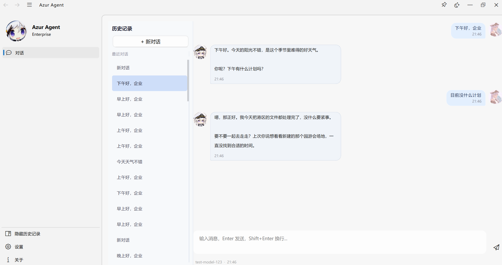

# Azur Agent 项目说明

> 基于 Qt6 + ElaWidgetTools 构建的 AI 角色扮演聊天软件。提示词是使用碧蓝航线的企业的台词构建的。目前支持日常聊天和简单的代码生成以及工具调用。目前还在开发阶段。
  
## 聊天界面展示

  
## 相关文档链接
 [关键设计决策](docs/关键设计决策.md) 
 [常见问题与对策](docs/常见问题与对策.md) 
 [构建与运行](docs/构建与运行.md) 
 [架构总览](docs/架构总览.md) 
 [类关系图](docs/类关系图.md) 
 [数据流](docs/数据流.md) 
 [文件详解](docs/文件详解.md) 
 [项目概览](docs/项目概览.md) 

